En el laboratorio especificado por la plataforma TryHackme, brinda la siguiente imagen para responder una serie de preguntas.

1) ¿De qué es el avatar de este usuario?

Descargando el recurso png que brinda el laboratorio, se observa que el contenido es el fonde de pantalla de WindosXP, rezaon por la cual no es posible obtener el avatar por el cual se pregunta. En base a lo anterior, es necesario obtener la metadata de la imagen, por lo cual se procede a usar la herramienta exiftool, obteniendo la siguiente información:

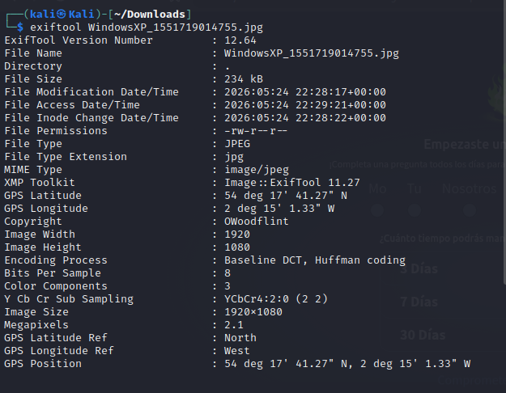

es de apreciarse que respuesta a la pregunta no esta presente en la metada, pero si exite un dato importante y es el **Copyrigth**, con el valor de este dato,  podemos realizar una breve busqueda en internet
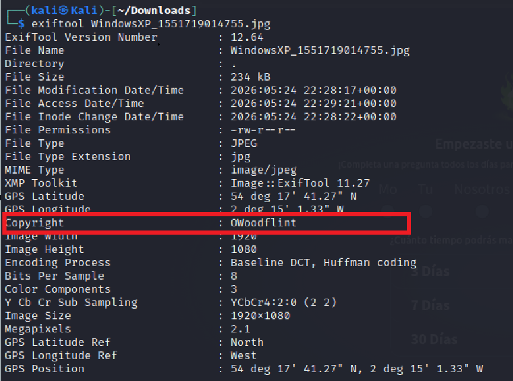

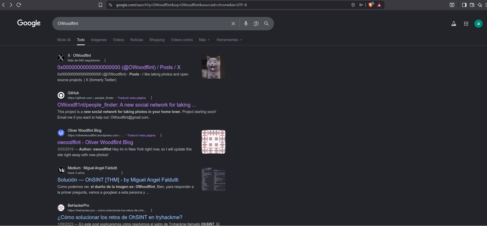

como se puede observar en las imagenes anteriores, se tiene información de diferentes recurso web, si se accede al recurso de la pagina **X**, se puede obsercar que el avatar para este usuario es un **gato**, por lo cual la respuesta a esta pregunta es un **gato**.

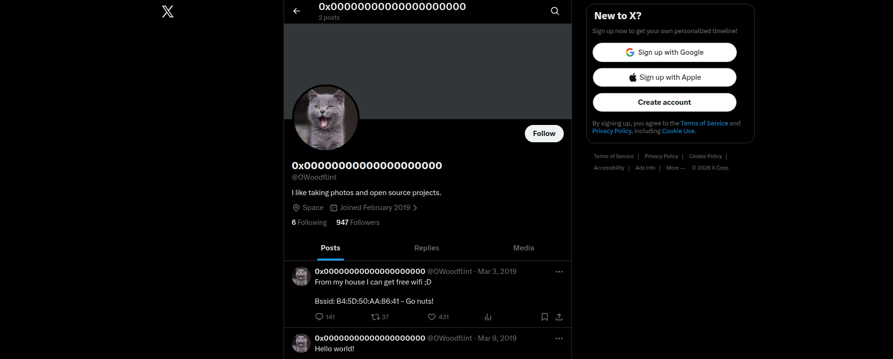

2) ¿En qué ciudad se encuentra esta persona?

accediendo a los enlaces que estan relacionados al autor de la imagen, se evidencia que existe una cuenta de github, con un repositorio publico el cual en si descripcion cometa el lugar de ubicación, en este caso **Londres**

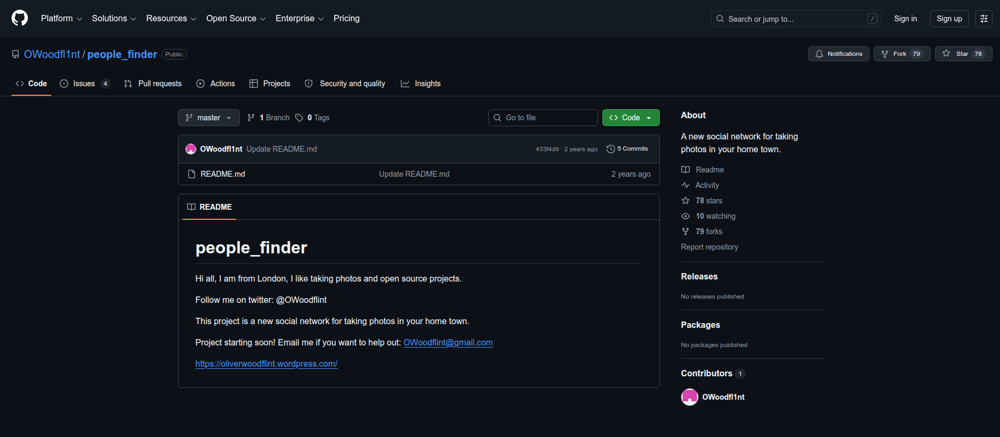

3) ¿Cuál es el SSID del WAP al que se conectó?

en la metadata de la imagen suministrada no se evidencia tal información, pero en el punto uno se puede observar en su cuenta **X**, exponse su bssid **B4:5D:50:AA:86:41**

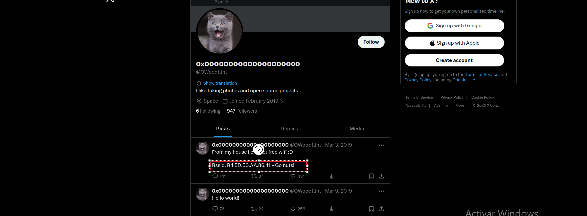

para obtener el  ssid, es necesario hacer uno de una pagina que tiene el registro publico de todas las conexiones en la red de bssid, dando a conocer  la ciudad, el ssid y otros datos de... la pagina se llama WiGle.net

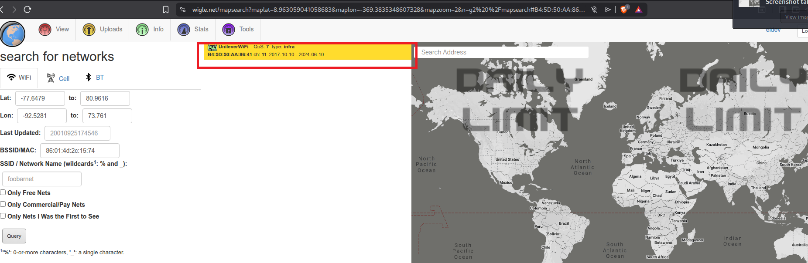

Por lo cual, la respuesta a este item  es **UnileverWIFI**

4) ¿Cuál es su dirección de correo electrónico personal?

la dirección de correo electrónico la podemos observar en la página de github que se evidencia al realizar la busqueda 

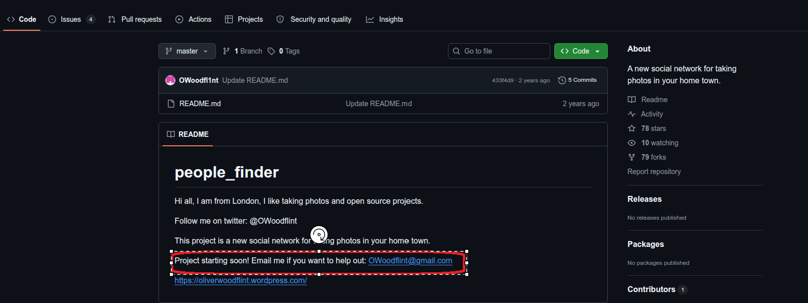

5) ¿En qué sitio encontraste su dirección de correo electrónico?

se encuenta en el sitio de github

6) ¿A dónde ha ido de vacaciones?

esta es una pregunta un poco confusa, debido a que la metadata no brinda esa info, pero realizando la busqueda en los sitios encontrados, se evidencia que ha ido  new york, segun el blog de wordpress

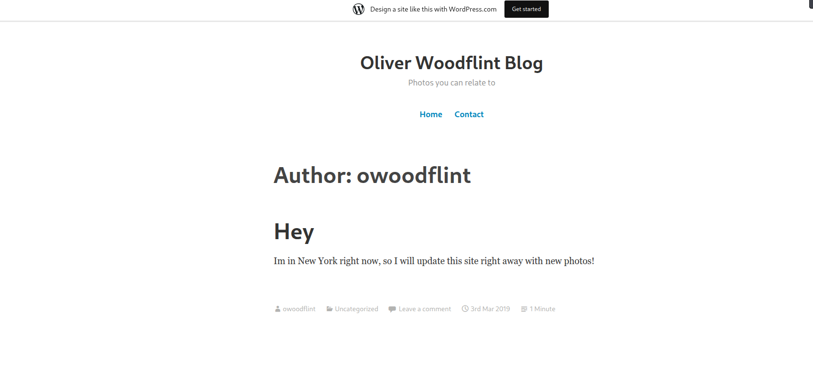

7) ¿Cuál es la contraseña de la persona?

 a simple vista, no se observa este dato. Pero si accedemos a las opciones de desarrollador  y se analiza el html, se puede econtrar la contraseña del usuario 

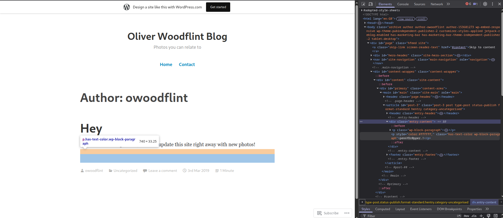

se puede observar que hay texto oculo por una propiedad css, si editamos esa propiedad, se puede evidenciar la contraseña o simplemente sacarla del texto que se puede observar **pennYDr0pper.!**

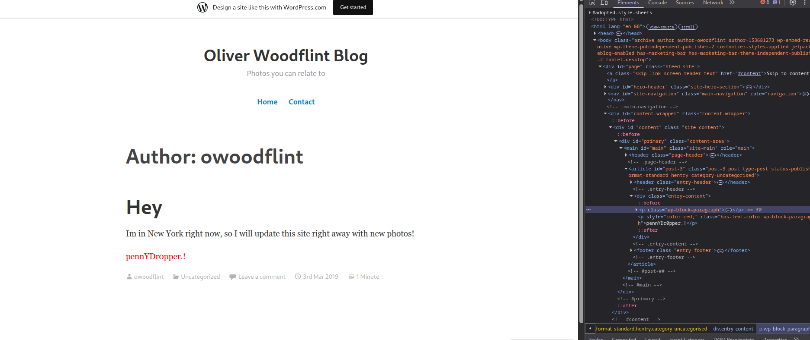

